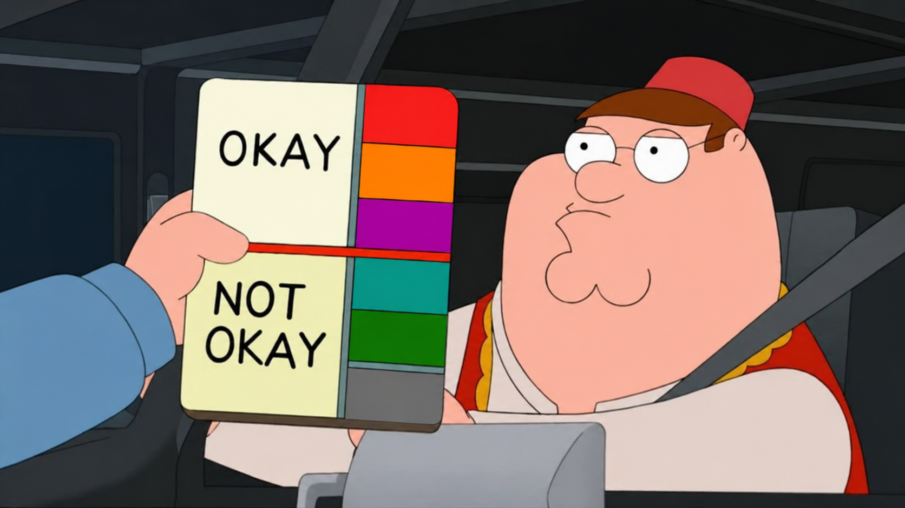

  

  <b>So you're a proud ratist? Here's why that's problematic.</b> 
  Just kidding, me too.

**GRAYtist** is a browser extension that helps you filter out low-quality content from Codeforces.

You might say: "But [DNR](https://codeforces.com/profile/DNR), such a tool would surely spam some API calls or use some heavyweight classifier models! My potato PC couldn't handle it!"

The answer is no. We instead use the principle of ratism ($P(\text{low rating} \iff \text{low quality}) \approx 1$) to optimize away all of that nonsense.

## Features

### 1. Filter blogs by author rank and title

- Don't want to see blogs from grays because they're annoying, and blogs from nutellas because they make you feel inferior? GRAYtist allows you to filter blogs for any combination of author ranks.
- Tired of seeing the 1e9-th blog about cheaters? GRAYtist supports filtering blogs by keywords in the title (regex and substring-matching are supported too).
- Filtered blogs are moved to a disjoint "Filtered recent actions" below the original component.

### 2. Filter comments by author rank

- Consider this: You're going through an editorial for a div-1+2 round and looking for thoughtful discussion on F, but 95% of the comments are grays/greens expounding on the intricacies of the 800-rated B. GRAYtist lets you filter any combination of author ranks.
- Filtered comments are automatically minimised (using Codeforces's native "hide" option) when you navigate to a blog.

### 3. Filter standings by participant rank

- Tired of being greeted by the sight of 100 grays (definitely not using AI) above you whenever you open the standings during a round? GRAYtist lets you filter standings by rank.
- Choose a set of filtered ranks (for instance: unrated, grey, green), and they get moved to a disjoint "Filtered standings" below the original component.

### 4. Whitelisting

- To avoid accidentally filtering content by users like [atcoder_official](https://codeforces.com/profile/atcoder_official), [ICPCNews](https://codeforces.com/profile/ICPCNews), etc., GRAYtist has a global whitelist. Content from any user in this whitelist will not be filtered out, no matter what.
- I've added a few users to this whitelist by default.

## Installation

No public store listing yet (I'm too lazy), so you'll have to install it manually.

### Chromium (Chrome, Brave, Edge, etc.)

1. Download `graytist-0.1.0-chrome.zip` from the [latest release](https://github.com/welcome-to-the-sunny-side/graytist/releases/latest) and unzip it.
2. Open `chrome://extensions` (Brave: `brave://extensions`, Edge: `edge://extensions`).
3. Turn on **Developer mode** (top-right toggle).
4. Click **Load unpacked** and select the unzipped folder (the one with `manifest.json` inside).
5. Pin it from the puzzle-piece menu.

### Firefox

1. Download `graytist-0.1.0-firefox.xpi` from the [latest release](https://github.com/welcome-to-the-sunny-side/graytist/releases/latest).
2. Open it in Firefox and drag the file into a Firefox window, or press **Ctrl+O** and pick the `.xpi`.
3. Click **Add** when Firefox prompts.

Once it's installed, open any blog or standings page and toggle ranks from the popup.

  

